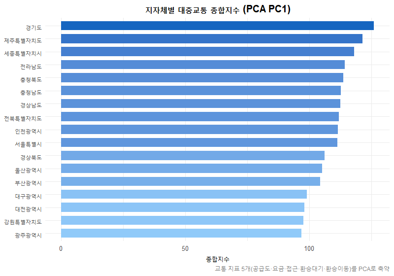
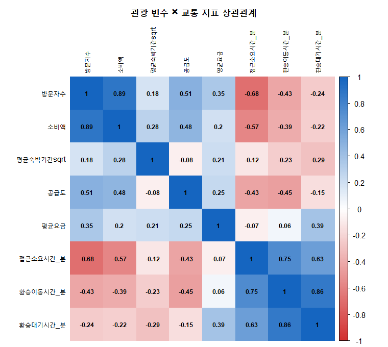
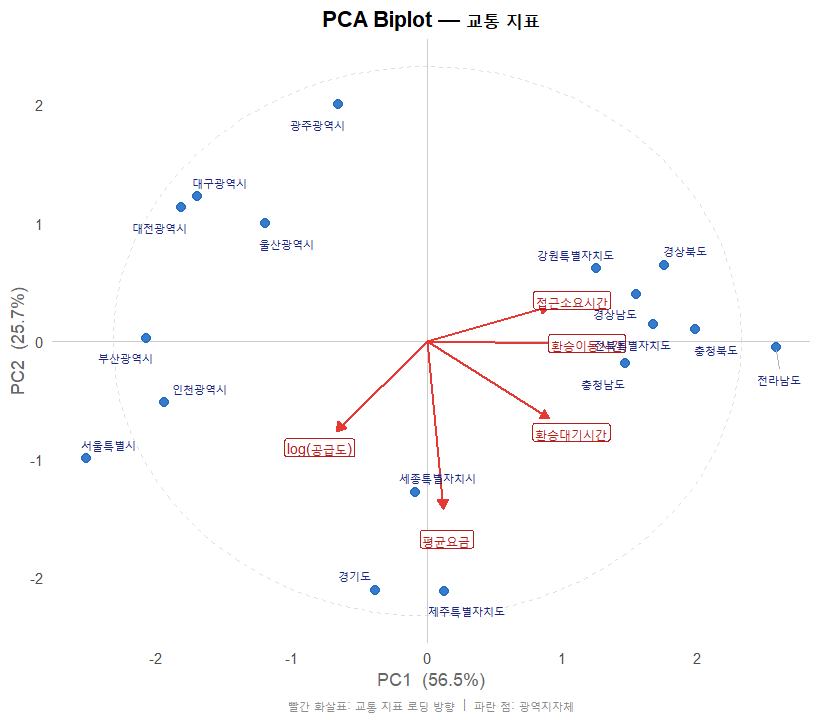

# 지자체별 대중교통 인프라와 방한 외래관광 활성화 분석

**학과 데이터분석 공모전 | 팀 (2인) | 2024.11 | 최우수상 수상**

## 요약

방한 외래관광객의 80% 이상이 서울권에 집중되는 문제에서 출발하여, 17개 광역지자체의 대중교통 지표가 관광 활성화에 미치는 영향을 통계적으로 검증한 프로젝트입니다. PCA로 교통 종합지수를 도출하고 다중회귀분석으로 관광 변수와의 관계를 밝혔으며, 공모전 제출 이후 분석의 한계점을 자체적으로 진단하고 개선 코드를 추가 작성했습니다.

---

## 문제 정의

개별여행 형태가 증가하면서 방한 외래관광객의 교통 접근성이 중요해졌으나, 방한관광객의 80% 이상이 서울로 집중되고 지방 관광은 상대적으로 취약한 상황입니다. 본 분석은 각 지역의 대중교통 인프라 수준이 방한관광 변수(방문자수, 소비액, 평균숙박기간)에 어떤 영향을 미치는지 검증하고자 했습니다.

---

## 데이터

| 구분 | 내용 |
|------|------|
| 기준연도 | 2023년 |
| 개체 | 17개 광역지자체 |
| 출처 | 한국관광공사 데이터랩, 한국교통안전공단, 교통카드 빅데이터 시스템 |

**변수 구성**

- **관광 변수 (3개):** 방문자수, 소비액, 평균숙박기간
- **교통 지표 (5개):** 정류장 공급도, 평균요금, 접근소요시간, 환승대기시간, 환승이동시간

분포의 대칭성과 선형성을 확보하기 위해 방문자수·소비액·공급도에 로그변환, 평균숙박기간에 제곱근변환을 적용했습니다.

---

## 분석 방법

1. **탐색적 데이터 분석** — 히스토그램, QQ플롯, 박스플롯으로 분포 확인 및 변환 결정
2. **상관관계 분석** — 교통 지표와 관광 변수 간 상관행렬 및 히트맵 시각화
3. **주성분 분석 (PCA)** — 교통 지표 5개를 종합지수로 축약
4. **다중회귀분석** — 종합지수와 관광 변수 3개의 관계 검증
5. **로버스트 회귀 & 커널 밀도 추정** — 이상치 영향 완화 및 분포 시각화
6. **계층적 군집분석** — 지자체 그룹화
7. **Wilcoxon 순위합 검정** — 교통 상위/하위 그룹 간 관광 변수 차이 검증

**사용 도구:** R (MASS, corrplot, ggplot2, aplpack)

---

##  핵심 결과

### 지자체별 교통 종합지수



### 상관관계 히트맵



### 다중회귀 결과

종합지수와 유의한 관계를 보인 변수는 **방문자수**와 **소비액**이었으며, 평균숙박기간은 유의하지 않았습니다.

> **y = 16.498 × log(방문자수) − 10.782 × log(소비액)**

### 상위/하위 지역

| 구분 | 지역 |
|------|------|
| 교통 상위 | 세종, 경기, 제주 |
| 교통 하위 | 광주, 대전, 강원 |

---

##  자체 개선 (공모전 제출 이후)

공모전 이후 분석의 한계점을 스스로 정리하고, 아래 3가지를 추가 작업했습니다.

### 1. 소표본 검정력 문제 → 순열검정 대안

상위/하위 각 3개 지역(n=3)에 대한 Wilcoxon 검정은 유의수준 0.05에서 귀무가설을 기각할 수 있는 경우의 수가 극히 제한됩니다. 이를 인식하고 순열검정(Permutation Test) 코드를 작성했으며, 그룹 기준을 5개로 확장하는 대안도 구현했습니다.

### 2. PCA 로딩 방향 미검토 → 바이플롯 추가

PC1 로딩값의 부호가 교통 "좋음/나쁨" 방향과 일치하는지 명시적으로 확인하는 코드를 추가하고, 바이플롯으로 각 변수와 주성분의 관계를 시각화했습니다.



### 3. 종합지수 산출 방식 개선

원점수 × 로딩 방식은 변수 간 스케일 차이가 결과에 과도하게 영향을 줄 수 있습니다. 표준화된 주성분 점수(pca_result$x)를 직접 사용하는 방식으로 변경하고, PC1 설명력이 부족할 경우 PC1+PC2 가중합산 방식도 구현했습니다.

---

## 프로젝트 구조

```
transit-tourism-analysis/
├── README.md
├── .gitignore
├── data/
│   ├── travel1.csv              # 17개 광역지자체 교통·관광 데이터 (2023)
│   └── data_description.md      # 변수 설명
├── src/
│   ├── analysis.Rmd             # 전체 분석 코드 (보고서)
│   ├── analysis.R               # 전체 분석 코드 (순수 R 스크립트)
│   └── generate_figures.R       # README 시각화 생성 스크립트
└── outputs/
    └── figures/
        ├── 01_transport_index.png
        ├── 02_correlation_heatmap.png
        └── 03_pca_biplot.png
```

---

## 실행 방법

**환경:** R (>= 4.0)

**필요 패키지:**
```r
install.packages(c("MASS", "corrplot", "ggplot2", "aplpack", "coin"))
```

**실행:**
1. 이 레포를 클론합니다
2. 시각화 생성: `src/generate_figures.R`을 실행합니다 (`outputs/figures/`에 PNG 저장)
3. 보고서 출력: `src/analysis.Rmd`를 RStudio에서 열고 Knit 합니다

---

## 수상

강원대학교 정보통계학과 통계 데이터분석 공모전 **최우수상** (2024.11)

---

## 작성자

**김예지** — 강원대학교 정보통계학과

- GitHub: [kyjwise7-hub](https://github.com/kyjwise7-hub)
- Portfolio: [kyjwise7.oopy.io](https://kyjwise7.oopy.io)
